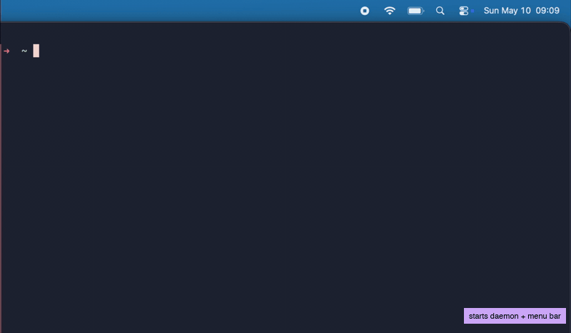

# Pace Coach

A macOS CLI daemon that monitors your typing rhythm and nudges you when your pace signals you're rushing. The goal is to support sustainable focus and healthy workflow patterns.

It monitors your keystrokes locally (nothing leaves your machine!), classifies your typing state every two seconds, fires a macOS notification when you've been in a rushing state for too long, and shows a live emoji in your menu bar with the status of the application.



Note that for above demo in the GIF the nudge fires earlier than in the default configuration.

**States:**

- ⚪ Idle — no recent typing
- 🔵 Passive — low activity or irregular rhythm
- 🟡 Normal — active, correction rate within range
- 🔴 Rushing — high correction rate sustained

The primary driver for the Rushing state is the correction rate.
See [`src/classifier.rs`](src/classifier.rs) for the full classification logic.

---

## Why

I built this to explore Rust and macOS native development, creating a lightweight CLI tool that provides awareness of my workflow patterns.
This is by no means a perfect tool and/or perfect code, but it was a fun way to get acquinted with these new technologies :)

---

## Privacy & Security

`pace-coach` runs entirely local on your machine. It never records, stores, or transmits the **content** of your keystrokes: only the **timing intervals between keypresses** are held in memory, and only long enough to compute the current pace metrics (2s). Once a classification cycle completes this data is discarded.

The macOS **Input Monitoring** permission is required to detect keypress events system-wide.

---

## Install

The following script downloads the latest release, extracts both binaries, and puts them in `/usr/local/bin`.
Please ensure that `/usr/local/bin` is available on your `$PATH`.

```sh
curl -fsSL https://raw.githubusercontent.com/job-almekinders/pace-coach/main/install.sh | sh
```

Requires Apple Silicon (arm64). The script downloads the latest release and installs both binaries to `/usr/local/bin`.

`pace-coach` requires **Input Monitoring** permission (System Settings → Privacy & Security → Input Monitoring). Please grant it on the first run.

---

## Usage

```bash
pace-coach start             # start daemon + menu bar icon
pace-coach stop              # stop both
pace-coach status            # NORMAL 🟡
pace-coach status --verbose  # full metrics
pace-coach config show       # print current config
```

---

## Configuration

Edit `~/.pace-coach/config.json` then restart the daemon:

```json
{
  "correction_rate_threshold": 0.06,
  "stress_duration_secs": 10,
  "nudge_cooldown_secs": 60
}
```

| Setting                     | Default | Description                                                                                  |
| --------------------------- | ------- | -------------------------------------------------------------------------------------------- |
| `correction_rate_threshold` | `0.06`  | Fraction of keystrokes that are corrections before state is Rushing. Lower = more sensitive. |
| `stress_duration_secs`      | `10`    | Seconds of sustained Rushing state before a nudge fires.                                     |
| `nudge_cooldown_secs`       | `60`    | Minimum seconds between nudges.                                                              |

---

## Logs

`~/.pace-coach/pace-coach.log` — daemon stderr. Useful for debugging.

---

## Build from source

Requires Rust stable ([rustup.rs](https://rustup.rs)) and Xcode Command Line Tools (`xcode-select --install`).

**Install both binaries locally:**

```bash
make install
```

This puts `pace-coach` and `pace-coach-menubar` in `~/.cargo/bin/`.

**Build release binaries only:**

```bash
make build
# binaries at target/release/pace-coach and target/release/pace-coach-menubar
```

---

## License

MIT

---

## Contributions

Contributions for fixes or feature additions are welcome! Feature additions I can foresee for this project are:

- A more user friendly installation method, such that non-technical users can also use `pace-coach`.
- A more user friendly method to call the CLI commands e.g. via the symbol in the menu bar.
- Validate and improve the classifier algorithm.
